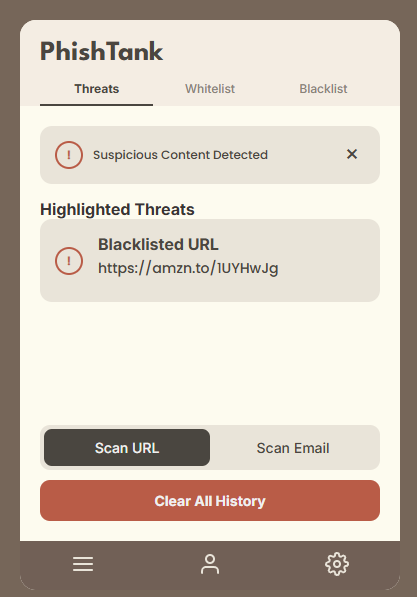
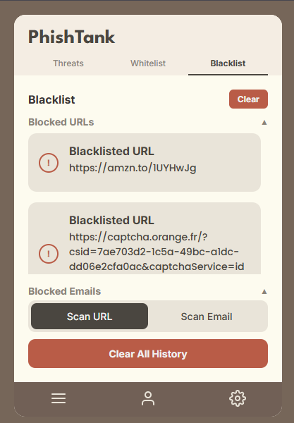
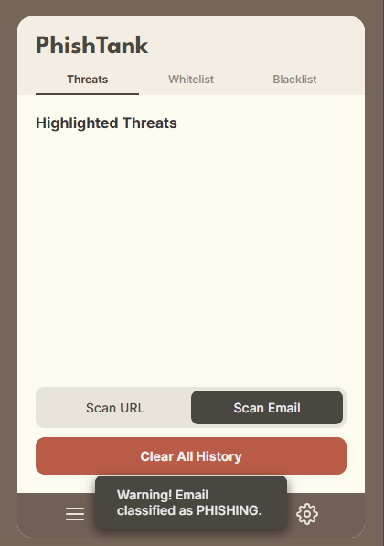
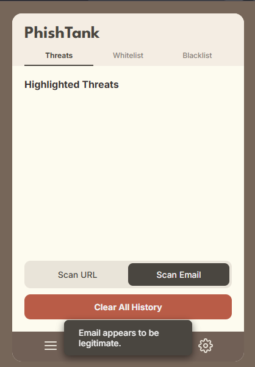
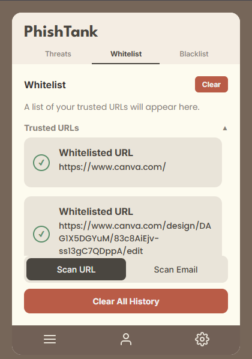
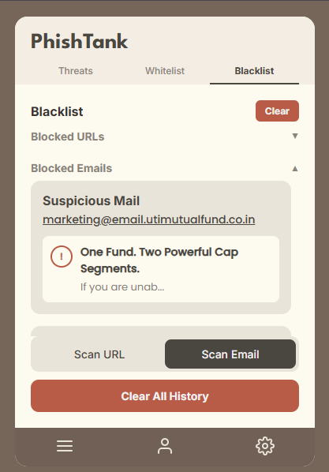

# PhishTank: phishing detection for URLs and emails

<div align="center">

[](https://www.python.org/downloads/)
[](https://fastapi.tiangolo.com/)
[](https://developer.chrome.com/docs/extensions/)

</div>

PhishTank is a practical phishing detection project with two independent models:
- URL phishing detection using TF-IDF + Logistic Regression
- Email phishing detection using DistilBERT

You can run it as a browser extension for day-to-day checks, or call it through a FastAPI backend.

## Table of contents

- [Overview](#overview)
- [Features](#features)
- [Architecture](#architecture)
- [Tech stack](#tech-stack)
- [Installation](#installation)
- [Usage](#usage)
- [Machine learning models](#machine-learning-models)
- [Datasets](#datasets)
- [Results and performance](#results-and-performance)
- [UI](#ui)
- [Privacy and security](#privacy-and-security)

## Overview

Phishing attacks come in two common forms: suspicious URLs and deceptive email text. This project handles both.

1. URL model: catches lexical URL patterns common in phishing links.
2. Email model: catches phishing intent in email content using contextual language modeling.

The codebase includes:
- Chrome extension frontend for real-time checks
- FastAPI backend with prediction endpoints
- Notebooks for training, evaluation, and visualization

## Features

### URL detection
- Real-time URL scanning while browsing
- Character-level TF-IDF features (n-grams 3-5)
- Logistic Regression classifier with strong baseline performance
- Safety indicator for quick decisions

### Email detection
- DistilBERT-based binary email classification
- Multi-source phishing email training data
- Sender, subject, and body supported in API payload
- Confidence score in responses

### Extension workflow
- Popup UI for threat status and scans
- Threat tracking views (blacklist/whitelist)
- Manual checks when needed

## Architecture

```text
PhishTank/
|-- manifest.json
|-- background.js
|-- content.js
|-- ui.js
|-- index.html
|-- style.css
|-- backend/
|   |-- app.py
|   |-- requirements.txt
|   |-- url/logreg_phishing_model/
|   `-- email/distilbert_phishing_model/
|-- URL_Phishing_Detection.ipynb
`-- phishing_email_analysis_bert.ipynb
```

## Tech stack

### Machine learning
- Python 3.8+
- scikit-learn (URL model)
- transformers + PyTorch (email model)
- pandas, NumPy, matplotlib, seaborn

### Backend
- FastAPI
- Pydantic
- joblib

### Frontend
- JavaScript (ES6+)
- HTML/CSS
- Chrome Extension APIs

## Installation

### Prerequisites
- Python 3.8+
- Chrome or Edge
- Node.js (optional, for local frontend tooling)

### 1. Clone the repository

```bash
git clone https://github.com/yourusername/PhishTank.git
cd PhishTank
```

### 2. Set up backend

```bash
cd backend
pip install -r requirements.txt
python app.py
```

API base URL:

```text
http://localhost:8000
```

Expected model locations:
- backend/url/logreg_phishing_model/
- backend/email/distilbert_phishing_model/

### 3. Load extension

1. Open chrome://extensions/ or edge://extensions/
2. Enable Developer mode
3. Click Load unpacked
4. Select the PhishTank project folder

## Usage

### Browser extension

1. Browse normally and let the extension scan URLs automatically.
2. Open the extension popup to run manual checks.
3. Green indicates safe, red indicates phishing risk.

### API endpoints

#### URL prediction

```http
POST /predict/url
Content-Type: application/json

{
  "url": "https://example-suspicious-site.com"
}
```

Sample response:

```json
{
  "url": "https://example-suspicious-site.com",
  "prediction": "phishing",
  "label": 1,
  "timestamp": "2025-10-12T10:30:00"
}
```

#### Email prediction

```http
POST /predict/email
Content-Type: application/json

{
  "sender": "noreply@suspicious.com",
  "subject": "Urgent: Verify your account",
  "body": "Dear user, click here to verify..."
}
```

Sample response:

```json
{
  "prediction": "phishing",
  "confidence": 0.95,
  "label": 1,
  "processed_date": "2025-10-12T10:30:00"
}
```

#### Health check

```http
GET /health
```

## Machine learning models

### URL phishing model

Algorithm: Logistic Regression with character-level TF-IDF.

```python
vectorizer = TfidfVectorizer(
    max_features=5000,
    analyzer='char_wb',
    ngram_range=(3, 5)
)

model = LogisticRegression(max_iter=200)
model.fit(X_train, y_train)
```

Why this is useful in practice:
- Phishing URLs often use slight character tricks.
- Character n-grams capture those patterns well.
- The model is lightweight and fast to serve.

### Email phishing model

Algorithm: DistilBERT fine-tuned for binary classification.

```python
model = DistilBertForSequenceClassification.from_pretrained(
    'distilbert-base-uncased',
    num_labels=2
)

trainer = Trainer(
    model=model,
    args=training_args,
    train_dataset=train_dataset,
    eval_dataset=test_dataset
)
```

Why this is useful in practice:
- It uses context, not just keywords.
- It generalizes better to varied phishing phrasing than keyword rules.

## Datasets

### URL phishing dataset
- Source: [Web Page Phishing Detection Dataset](https://www.kaggle.com/datasets/shashwatwork/web-page-phishing-detection-dataset)
- Size: 10,000+ labeled URLs
- Split: 80% train, 20% test

### Email phishing dataset
- Source: [Phishing Email Dataset](https://zenodo.org/records/8339691)
- Components: CEAS_08.csv, Nazario.csv, Nigerian_Fraud.csv, SpamAssasin.csv, TREC_06.csv
- Size: 30,000+ emails
- Split: 80% train, 20% test

## Results and performance

### URL model

| Metric | Score |
|--------|-------|
| Accuracy | 96.5% |
| Precision | 95.8% |
| Recall | 97.2% |
| F1-score | 96.5% |

### Email model

| Metric | Score |
|--------|-------|
| Accuracy | 98.2% |
| Precision | 97.9% |
| Recall | 98.5% |
| F1-score | 98.2% |

These scores are from notebook evaluations in this project and should be treated as dataset-specific.

## UI

### Extension interface

<div align="center">
  <table>
    <tr>
      <td align="center" width="50%">
        
        <br/>
        <em>Main popup with status and analysis controls.</em>
      </td>
      <td align="center" width="50%">
        
        <br/>
        <em>Threats tab with flagged URL details.</em>
      </td>
    </tr>
    <tr>
      <td align="center" width="50%">
        
        <br/>
        <em>Email phishing classification result.</em>
      </td>
      <td align="center" width="50%">
        
        <br/>
        <em>Email legitimate classification result.</em>
      </td>
    </tr>
    <tr>
      <td align="center" width="50%">
        
        <br/>
        <em>Whitelist management for trusted URLs.</em>
      </td>
      <td align="center" width="50%">
        
        <br/>
        <em>Blacklist management for blocked entries.</em>
      </td>
    </tr>
  </table>
</div>

## Privacy and security

- URL checks can run locally in extension workflow where applicable.
- The project does not store browsing history by default.
- API communication should be served over HTTPS in deployment.
- The codebase is open for inspection and review.